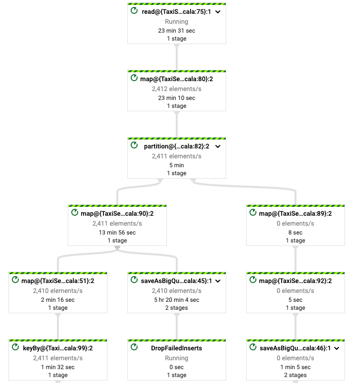

# Dataflow Streaming example with Scio

This is the example used in the Scio/Scala workshop in the Beam Summit 2021

* https://2021.beamsummit.org/sessions/scala-streaming-pipeline-using-scio/

Branches in this repo:

* `master`, wih incomplete code with some exercises
* `solution`, with the solution to the exercises

## Description of the pipeline

This pipeline takes some JSON data from a public PubSub topic, parses the JSON strings into a custom case class,
aggregates some of the produced objects, and writes some output to BigQuery.

You need to have a project in Google Cloud Platform in order to run this pipeline.

## How to launch the pipeline

Run `sbt pack` to generate a package for the pipeline, and the use the launch script with your project name

`$ ./launch.sh $MY_PROJECT_NAME`

You should have installed `gcloud` authenticated with the necessary credentials, or those credentials should be
available in the environment variable `GOOGLE_APPLICATION_CREDENTIALS`. For more details
see https://cloud.google.com/docs/authentication/getting-started

In the Dataflow UI, you should a graph of the pipeline like this one:



The script assumes that you want to launch the pipeline in `europe-west1` and that you have the following resources in
your project already created

* A BigQuery dataset called `taxi_rides`
* A Cloud Storage bucket called `gs://${MY_PROJECT_NAME}`

You should create both resources, in the same region as where you are launching the pipeline.

The launch script will delete tables in your BigQuery dataset, so use a new sandbox dataset to try this pipeline out.

### Input data

The pipeline reads data from this public PubSub topic:

`projects/pubsub-public-data/topics/taxirides-realtime`

### Output data

The pipeline will create three tables in BigQuery:

* `rides`, with the same schema and contents as the incoming messages
* `agg`, with Taxi rides aggregated together
* `errors`, with details about any message that could not be parsed from the input data source.

## Testing

The pipeline comes with a set of unit tests. To run them, please do

```
sbt test
```

In the master branch, one test will fail because one of the exercises is incomplete.

## License

Copyright 2011 Israel Herraiz

Licensed under the Apache License, Version 2.0 (the "License"); you may not use this file except in compliance with the
License. You may obtain a copy of the License at

      http://www.apache.org/licenses/LICENSE-2.0

Unless required by applicable law or agreed to in writing, software distributed under the License is distributed on an "
AS IS" BASIS, WITHOUT WARRANTIES OR CONDITIONS OF ANY KIND, either express or implied. See the License for the specific
language governing permissions and limitations under the License.